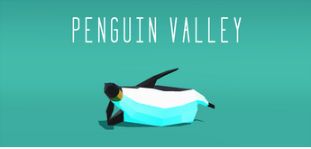

Il progetto nasce come una piattaforma digitale che raccoglie foto di pinguini e li distribuisce.

## Sistema simile

Un sistema simile è DogAPI (https://dog.ceo/dog-api/), una collezione di foto di cani online, tramite delle api.

# [RAD](Documentazione/RAD%20Penguin%20Valley.docx) non completo

## Back-end

Realizzato con Spring

